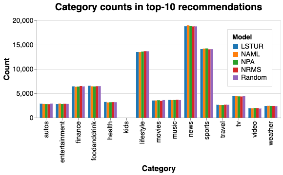
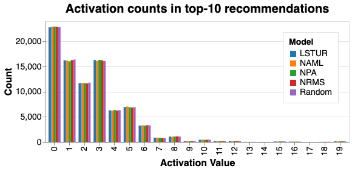

# Examining Sensitivity and Representativeness of Normative Diversity Metrics

This repository contains the supporting material for the paper 'Examining Sensitivity and Representativeness of Normative Diversity Metrics'. We reproduce the paper 'RADio* – An Introduction to Measuring Normative Diversity in News Recommendations'. The code in the 'dart/' folder comes from the original RADio implementation, [that can be found here](https://github.com/svrijenhoek/RADio). 

## Get Started

1. Download this repository
2. Open your Terminal in the directory of this repository
3. Run ```mkdir data```
4. [Download the required files here](https://www.dropbox.com/scl/fi/ywvdjb6g6fq9igdjz34cc/data.zip?rlkey=o1n90ipkkdrhslryjxf8xt401&st=8ipbz0lh&dl=0)
5. Unzip the downloaded file, and move its contents to the ```data/``` folder.
6. [Download the MIND dataset here](https://msnews.github.io/)
7. Unzip the downloaded file, and move its contents the the ```data/MIND/``` folder.

#### RADio on MIND

Run ```python compute_radio.py```

#### Analysis of Different User Samples

```Results.ipynb``` is a notebook containing code to process the results, do significance testing and visualize the metrics as the user sample size increases.

#### Simulation of Rankers

```Simulate.ipynb``` is a notebook containing the simulation of different rankers with a shared distribution as mentioned in 'Examining Sensitivity and Representativeness of Normative Diversity Metrics'. It also contains an analysis of the output of different news recommenders on the MIND dataset.

## Results

The Python scripts write their results to the ```results/``` folder. The Jupyter Notebook ```Results.ipynb``` contains the code necessary to generate the figures from the paper 'Examining Sensitivity and Representativeness of Normative Diversity Metrics'.

## Data Generation

By downloading the files in the 'Get Started' section, you have access to all data and recommendations necessary to run our experiments. If you want to generate the recommendation sets yourself, you can follow these instructions.

1. Run ```generate_baselines.py```
2. Use the [Recommenders Team](https://github.com/recommenders-team/recommenders) repository to train the NAML, NPA, NRMS and LSTUR models
3. Use the trained models to generate recommendations for the corresponding files in ```data/MIND/MINDLarge_dev```

# Additional Results

## Figures

<div style="display: flex; justify-content: center; align-items: center; gap: 10px;">
    
    
</div>

## Results on sample of MIND with available body texts

| Column 1 | Column 2 | Column 3 |
| -------- | -------- | -------- |
| Row 1, Cell 1 | Row 1, Cell 2 | Row 1, Cell 3 |
| Row 2, Cell 1 | Row 2, Cell 2 | Row 2, Cell 3 |
| Row 3, Cell 1 | Row 3, Cell 2 | Row 3, Cell 3 |d